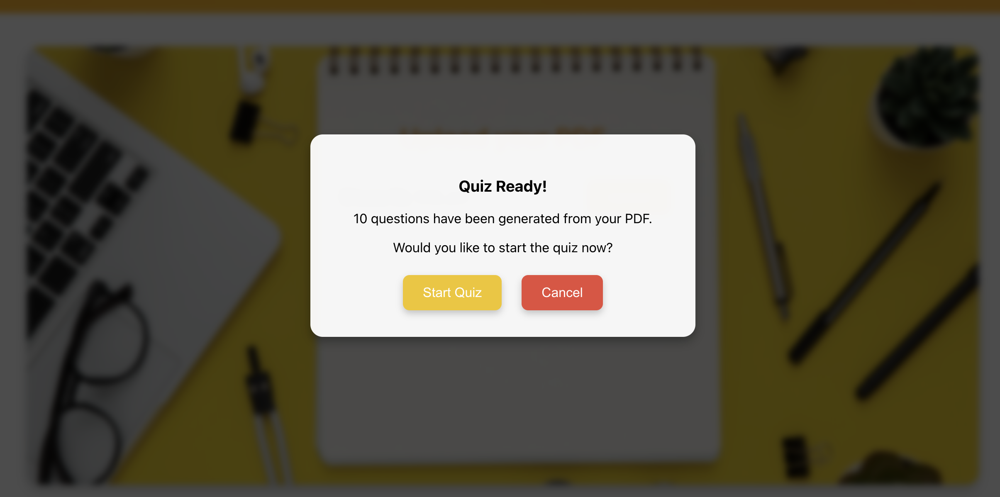
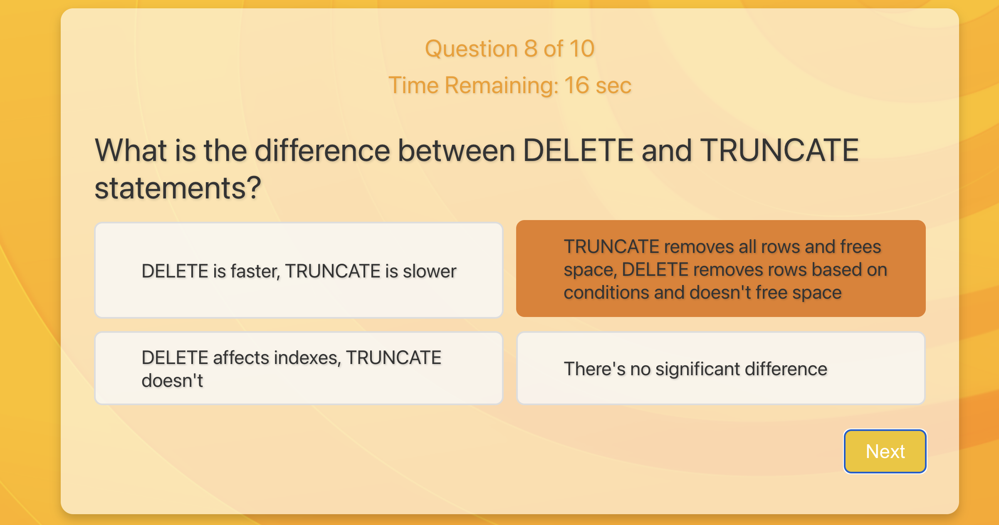

# 📚 Quiz Web Application

An advanced **Quiz Web Application** powered by **Generative AI (GenAI)** and **ReactJS**. This app dynamically generates multiple-choice questions from uploaded PDF documents, with automated grading and instant feedback for an interactive and seamless user experience.

---

## 🚀 Features

- **📄 PDF Upload:** Upload PDF documents to auto-generate quiz questions.
- **🧠 AI-Powered Question Generation:** Utilizes **Google GenAI API** to create diverse multiple-choice questions.
- **✅ Auto-Grading System:** Automatically evaluates answers and provides real-time feedback.
- **⚡ Dynamic User Interface:** Built with **ReactJS** for a responsive and engaging UI.

---

## 🛠️ Technologies Used

- **Frontend:** ReactJS  
- **Backend:** Node.js, Express.js  
- **File Handling:** Multer for efficient file uploads  
- **AI Integration:** Google GenAI API for smart question generation

---

## ⚙️ Setup & Installation

### 1️⃣ Clone the Repository
```bash
git clone https://github.com/your-repo/webquiz.git
```

### 2️⃣ Navigate to the Project Directory
```bash
cd quizweb
```

### 3️⃣ Install Dependencies
- **Frontend:**
  ```bash
  cd frontend
  npm install
  ```
- **Backend:**
  ```bash
  cd ../backend
  npm install
  ```

### 4️⃣ Configure Environment Variables
Create a `.env` file in the `backend` directory:
```env
GOOGLE_API_KEY=your_google_api_key
```

### 5️⃣ Start the Backend Server
```bash
cd backend
node server.js
```

### 6️⃣ Start the Frontend Development Server
```bash
cd ../frontend
npm start
```

---

## 🎯 How to Use

1. **Open** the web application in your browser.
2. **Upload** a PDF document to generate quiz questions.
3. **Answer** the generated questions.
4. **Submit** your quiz to receive instant grading and feedback.

---

## 📁 Project Structure
```plaintext
quizweb/
├── frontend/
│   ├── src/
│   │   └── components/
│   │       ├── HomePage.js
│   │       └── QuizPage.js
│   └── public/
├── backend/
│   ├── uploads/
│   ├── questions.json
│   └── server.js
```

---

## 🖼️ Screenshots

### 🏠 Home Page


### 📤 Upload Page


### ✅ Upload Confirmation


### 📝 Quiz Page


### 📊 Results Page


---

## 👨‍💻 Author

Developed with ❤️ by **Manav Mangela**

---

## 🤝 Contributing

Contributions are welcome! Feel free to **fork**, **raise issues**, or **submit pull requests** to help improve the project.

---

**⭐ If you like this project, give it a star on GitHub! ⭐**

