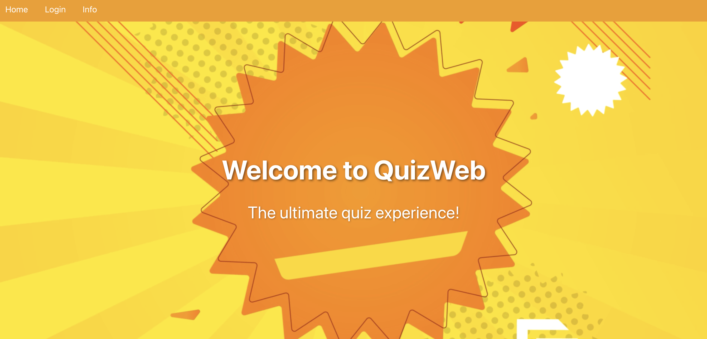

# 📚 QuizWeb – AI-Powered Quiz Generator  
**FastAPI + React + Google Gemini AI**


QuizWeb is an intelligent platform that transforms uploaded PDFs into interactive multiple-choice quizzes using Google Gemini AI. Users can register, take AI-generated quizzes with a beautiful video-based interface, track their performance, and admins can manage all quiz activities.

---

## 🎯 Key Highlights

- **🤖 AI-Powered**: Leverages Google Gemini AI to automatically generate contextual quiz questions from any PDF
- **⏱️ Interactive Experience**: Timed quizzes with an immersive video background interface
- **📊 Comprehensive Analytics**: Detailed performance tracking (correct, incorrect, skipped questions)
- **🔐 Authentication System**: Secure user registration and login with role-based access
- **👨‍💼 Admin Dashboard**: Manage quizzes, monitor attempts, and analyze user performance
- **🎨 Modern UI/UX**: Clean, responsive design with custom video backgrounds

---

## ✨ Features

### 🧑‍🎓 User Features
- **PDF Upload & Quiz Generation**: Upload any PDF document and let AI generate relevant quiz questions
- **Timed Quizzes**: Take interactive quizzes with countdown timers
- **Beautiful UI**: Engaging video background interface for an immersive experience
- **Instant Feedback**: View detailed results showing correct, incorrect, and skipped answers
- **User Authentication**: Secure login and registration system (localStorage-based)
- **Quiz History**: Access and review all previous quiz attempts
- **Performance Tracking**: Monitor your progress and scores over time

### 🛠️ Admin Features
Admin privileges are automatically granted to users with the username **"manav"**.

- **Dashboard Overview**: Comprehensive view of all quiz attempts across the platform
- **Result Management**: View result ID, username, quiz title, score, and timestamp
- **Content Moderation**: Delete quizzes or individual attempts
- **Advanced Filtering**: Real-time filtering by user, quiz title, score, date, and more
- **Data Integrity**: Automatic prevention of duplicate result entries
- **User Analytics**: Track user engagement and quiz performance metrics

---

## 🏗️ Tech Stack

### Frontend
| Technology | Purpose |
|------------|---------|
| **React.js** | UI framework for building interactive components |
| **Context API** | Global state management for authentication |
| **Axios** | HTTP client for API communication |
| **Custom Components** | Video-based UI elements and animations |

### Backend
| Technology | Purpose |
|------------|---------|
| **FastAPI** | High-performance Python web framework |
| **SQLAlchemy** | ORM for database interactions |
| **SQLite** | Lightweight relational database |
| **PyPDF2** | PDF text extraction and parsing |
| **Google Gemini AI** | AI-powered question generation |

---

## 📂 Project Structure

```
quizweb/
│
├── backend/
│   ├── main.py              # FastAPI application entry point
│   ├── routes.py            # API route definitions
│   ├── services.py          # Business logic and database services
│   ├── models.py            # SQLAlchemy database models
│   ├── questions.json       # Generated quiz questions cache
│   ├── requirements.txt     # Python dependencies
│   ├── uploads/             # Uploaded PDF storage directory
│   └── quiz.db              # SQLite database (auto-generated)
│
├── frontend/
│   ├── public/
│   │   ├── assets/          # Static assets (images, videos)
│   │   └── index.html
│   └── src/
│       ├── components/      # React components
│       │   ├── Login.jsx
│       │   ├── Quiz.jsx
│       │   ├── Results.jsx
│       │   └── AdminDashboard.jsx
│       ├── context/         # Context API providers
│       │   └── AuthContext.js
│       ├── styles/          # CSS stylesheets
│       ├── App.js           # Main application component
│       └── index.js         # React entry point
│
├── .gitignore
├── package.json
└── README.md
```

---

## ⚙️ Installation & Setup

### Prerequisites
- **Python 3.8+**
- **Node.js 14+** and **npm**
- **Google Gemini API Key** ([Get one here](https://makersuite.google.com/app/apikey))

### 🔧 Backend Setup

#### 1️⃣ Navigate to backend directory
```bash
cd backend
```

#### 2️⃣ Create and activate virtual environment
**On macOS/Linux:**
```bash
python3 -m venv venv
source venv/bin/activate
```

**On Windows:**
```bash
python -m venv venv
venv\Scripts\activate
```

#### 3️⃣ Install dependencies
```bash
pip install -r requirements.txt
```

#### 4️⃣ Configure environment variables
Create a `.env` file in the backend directory:
```env
GEMINI_API_KEY=your_google_gemini_api_key_here
DATABASE_URL=sqlite:///./quiz.db
```

#### 5️⃣ Initialize database
```bash
python -c "from services import init_db; init_db(); print('✅ Database initialized successfully')"
```

#### 6️⃣ Run FastAPI server
```bash
uvicorn main:app --reload --port 5001
```

**Backend will be available at:** `http://localhost:5001`  
**API Documentation:** `http://localhost:5001/docs`

---

### 💻 Frontend Setup

#### 1️⃣ Navigate to frontend directory
```bash
cd frontend
```

#### 2️⃣ Install dependencies
```bash
npm install
```

#### 3️⃣ Configure API endpoint (if needed)
Update the API base URL in `src/config.js` or your axios configuration:
```javascript
const API_BASE_URL = 'http://localhost:5001/api';
```

#### 4️⃣ Start development server
```bash
npm start
```

**Frontend will be available at:** `http://localhost:3000`

---

## 📡 API Documentation

### 📥 Quiz Management

#### Upload PDF & Generate Quiz
```http
POST /api/upload
Content-Type: multipart/form-data

Body:
- file: PDF file
- title: Quiz title (optional)
```

**Response:**
```json
{
  "quiz_id": 1,
  "title": "Sample Quiz",
  "questions_count": 10,
  "message": "Quiz generated successfully"
}
```

---

### ❓ Questions

#### Fetch Quiz Questions
```http
GET /api/questions?quiz_id=1
```

**Response:**
```json
{
  "quiz_id": 1,
  "title": "Sample Quiz",
  "questions": [
    {
      "id": 0,
      "question": "What is the capital of France?",
      "options": ["London", "Paris", "Berlin", "Madrid"],
      "correct_answer": "B"
    }
  ]
}
```

---

### 📝 Submit Answers

#### Submit Quiz Answers
```http
POST /api/submit
Content-Type: application/json
```

**Request Body:**
```json
{
  "quiz_id": 1,
  "answers": {
    "0": "B",
    "1": "A",
    "2": "C"
  },
  "user": {
    "name": "John Doe",
    "email": "john@example.com"
  }
}
```

**Response:**
```json
{
  "result_id": 42,
  "score": 8,
  "total_questions": 10,
  "correct": 8,
  "incorrect": 1,
  "skipped": 1,
  "percentage": 80.0
}
```

---

### 🧾 Results

#### Get Latest Result
```http
GET /api/results/latest?user_email=john@example.com
```

#### Get All Results (Admin)
```http
GET /api/results
```

**Query Parameters:**
- `user_name`: Filter by username
- `quiz_title`: Filter by quiz title
- `min_score`: Minimum score filter
- `max_score`: Maximum score filter

#### Delete Result
```http
DELETE /api/results/{result_id}
```

---

### 🗂️ Quizzes

#### Get All Quizzes
```http
GET /api/quizzes
```

#### Delete Quiz
```http
DELETE /api/quizzes/{quiz_id}
```

---

## 🎮 Usage Guide

### For Users

1. **Register/Login**: Create an account or log in with existing credentials
2. **Upload PDF**: Navigate to the upload page and select a PDF document
3. **Wait for AI**: The system will extract text and generate quiz questions
4. **Take Quiz**: Answer questions within the time limit
5. **View Results**: See your score and detailed breakdown
6. **Track Progress**: Access quiz history from your dashboard

### For Admins

1. **Monitor Activity**: View all user quiz attempts in the dashboard
2. **Filter Results**: Use search and filter options to analyze data
3. **Manage Content**: Delete inappropriate quizzes or invalid attempts
4. **Analytics**: Track platform usage and user performance


## 🚀 Deployment

### Backend Deployment (Render/Railway/Heroku)

1. Update `requirements.txt` with production dependencies
2. Configure environment variables on your hosting platform
3. Update database to PostgreSQL for production
4. Set up proper CORS origins

### Frontend Deployment (Vercel/Netlify)

1. Update API endpoint to production URL
2. Build production bundle: `npm run build`
3. Deploy `build` folder to hosting service
4. Configure environment variables

---

## 🐛 Troubleshooting

| Issue | Solution |
|-------|----------|
| **PDF Upload Fails** | Check file size limits and PDF format compatibility |
| **AI Questions Not Generated** | Verify Gemini API key is valid and has quota |
| **Database Errors** | Re-run database initialization script |
| **CORS Errors** | Update CORS middleware in `main.py` |
| **Port Already in Use** | Change port in startup commands or kill existing process |

---

## 🖼️ Screenshots
### 🏠 Home Page


### 📑 Info Page


### 📤 Upload Page


### ✅ Upload Confirmation


### 📝 Quiz Page


### 📊 Results Page


### 📋 Admin Page


## 👨‍💻 Author

**Manav Mangela**

- 🌐 GitHub: [@Maaanav](https://github.com/Maaanav)
- 💼 LinkedIn: [manavmangela](https://linkedin.com/in/manavmangela)
- 📧 Email: manavmangela31@gmail.com

---

## ⭐ Show Your Support

If you find this project helpful, please give it a ⭐ on GitHub!

---

**Made with ❤️ by Manav Mangela**